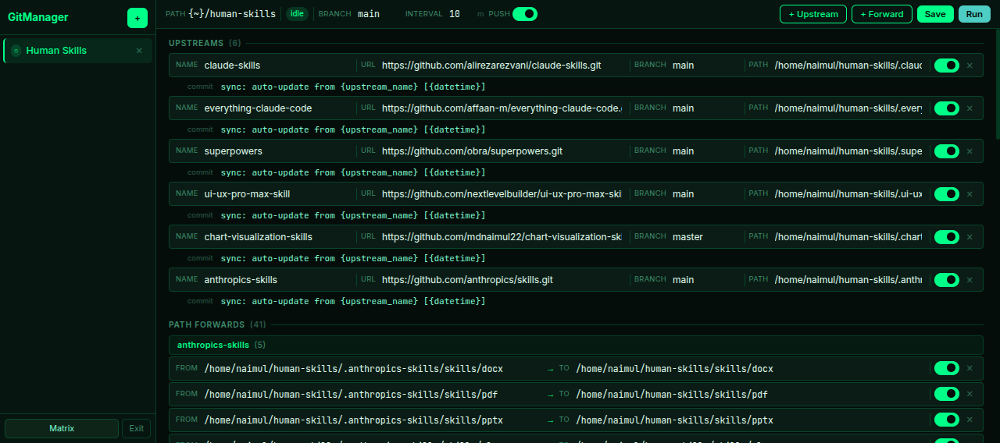

<div align="center">

# GitManager

### Multi-Project Upstream Sync Framework

[](https://python.org)
[](https://fastapi.tiangolo.com)
[](LICENSE)

**Automating Git synchronization — pull from multiple upstreams, forward selected paths, auto-commit and push, all on a schedule.**

[Features](#-features) · [Quick Start](#-quick-start) · [How It Works](#-how-it-works) · [API](#-api-reference) · [Docs](docs/USAGE.md)

---



</div>

---

## 🚀 What Is GitManager?

GitManager solves the "commit push" problem. If you maintain multiple projects that share code, skills, configs, or any files from external upstream repositories, GitManager automates the entire pipeline:

```
Upstream Repo A (GitHub)
Upstream Repo B (GitHub)     →  git pull  →  Forward selected paths  →  git commit + push
Upstream Repo C (GitHub)                      to your project dirs       to your repo
```

No more manually pulling repos, copying folders, and committing changes. GitManager does it all — on a schedule, in the background, with a beautiful dashboard to control everything.

No cloud. No account required. Runs entirely on your machine.

---

## ✨ Features

| Feature | Description |
|---|---|
| 🗂️ **Multi-Project** | Manage unlimited projects, each with its own upstreams, paths, and schedule |
| 🔄 **Upstream Pull** | Auto-pull or clone upstream repos by name, URL, and branch |
| 📁 **Path Forwarding** | Select which folders/files to copy from each upstream into your project |
| ⏰ **Scheduler** | Per-project interval (minutes) with background worker threads |
| 🔒 **Secure Auth** | HMAC-signed stateless session cookies — survives server restarts |
| 🎨 **9 Themes** | VS Code-inspired themes (Dark+, Dracula, Nord, One Dark, Catppuccin, and more) |
| 🧪 **39 Tests** | Full pytest coverage for auth, CRUD, and worker control |

---

## 📋 Requirements

- **Python** 3.10+
- **Git** installed and in PATH
- **Internet access** for upstream pulls (or local paths)

---

## ⚡ Quick Start

### 1. Clone the repository

```bash
git clone https://github.com/mdnaimul22/GitManager.git
cd GitManager
```

### 2. Install dependencies

```bash
pip install -r requirements.txt
```

### 3. Configure credentials

Copy `.env.example` to `.env` and set your login:

```bash
cp .env.example .env
```

```dotenv
GM_USERNAME=admin
GM_PASSWORD=your_secure_password
GM_SECRET_KEY=any_long_random_string_here
```

### 4. Run the server

```bash
python main.py
```

### 5. Open the dashboard

```
http://localhost:8000
```

That's it. 🎉

---

## 🔍 How It Works

### Step 1 — Create a Project

Click **+** in the sidebar. Give it a name and the absolute path to your local Git repository.

### Step 2 — Add Upstreams

For each upstream source, define:
- **Name** — a label (e.g. `claude-skills`)
- **URL** — the GitHub clone URL (optional if already cloned locally)
- **Branch** — which branch to track (default: `main`)
- **Path** — where to clone it on your machine

GitManager will auto-clone on first run if the path doesn't exist.

### Step 3 — Define Path Forwards

For each upstream, specify which directories or files to copy into your project:

```
FROM: /home/user/.claude-skills/skills/python-patterns
  TO: /home/user/my-project/skills/python-patterns
```

Toggle individual forwards on/off without deleting them.

### Step 4 — Set the Schedule

Set the sync interval in minutes in the toolbar. Click **Run** to start the background worker — it will pull upstreams, forward paths, commit changes, and push automatically.

---

## 📁 Project Structure

```
GitManager/
├── main.py                  # Entry point — FastAPI server + port-kill on startup
├── requirements.txt
├── .env.example
├── src/
│   ├── config/              # Settings, paths, file utilities
│   ├── schema/              # Pydantic data models (single source of truth)
│   ├── core/
│   │   ├── watcher.py       # Hot-reload config watcher
│   │   ├── pool.py          # Background worker pool (per-project threads)
│   │   └── resolver.py      # {REPO_ROOT} placeholder resolver
│   ├── providers/
│   │   └── git.py           # Low-level git command wrapper
│   ├── services/
│   │   ├── project.py       # Project CRUD with threading.Lock
│   │   ├── upstream.py      # Pull / clone upstream repos
│   │   ├── forward.py       # Path forwarding (copy files)
│   │   └── sync.py          # Full sync orchestrator
│   └── routers/
│       ├── auth.py          # Login / logout / session check
│       └── projects.py      # Projects CRUD + worker control
├── static/
│   ├── index.html           # Single-page dashboard
│   ├── css/theme.css        # 9 VS Code-inspired themes
│   └── js/app.js            # AlpineJS frontend logic
├── data/                    # Per-project JSON config storage
├── docs/
│   ├── img/gitmgr.png       # Dashboard screenshot
│   └── USAGE.md             # Detailed usage guide
└── tests/                   # 39 pytest tests
    ├── conftest.py
    ├── test_auth.py
    └── test_projects.py
```

---

## 🌐 API Reference

All endpoints require authentication via session cookie (login at `/api/auth/login`).

| Method | Endpoint | Description |
|---|---|---|
| `POST` | `/api/auth/login` | Login with username & password |
| `POST` | `/api/auth/logout` | Logout (requires auth) |
| `GET` | `/api/auth/check` | Check current session |
| `GET` | `/api/projects` | List all projects |
| `POST` | `/api/projects` | Create a new project |
| `GET` | `/api/projects/{id}` | Get project details |
| `PUT` | `/api/projects/{id}` | Update project config |
| `DELETE` | `/api/projects/{id}` | Delete a project |
| `POST` | `/api/projects/{id}/run` | Start background sync worker |
| `POST` | `/api/projects/{id}/stop` | Stop background sync worker |

---

## 🤝 Contributing

1. **Fork** the repository
2. **Branch:** `git checkout -b feature/your-feature`
3. **Commit:** Follow conventional commit messages (`feat:`, `fix:`, `chore:`)
4. **Test:** `pytest tests/` must pass
5. **PR:** Open a Pull Request

---

## 📄 License

MIT License — free to use, modify, and distribute.

---

<div align="center">

**Made for developers who sync a lot.**

*If this tool saved you time, give it a ⭐ on [GitHub](https://github.com/mdnaimul22/GitManager)!*

</div>
