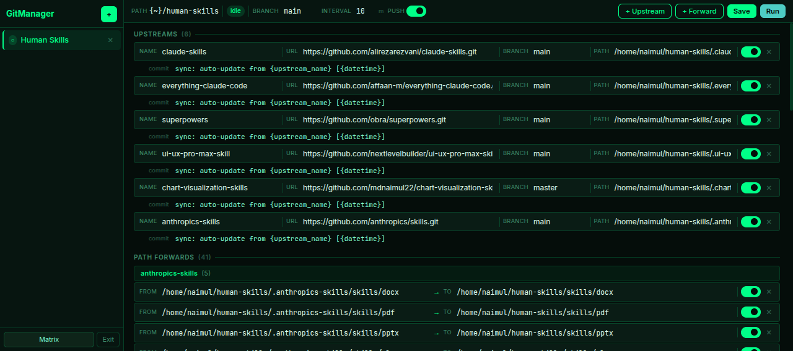
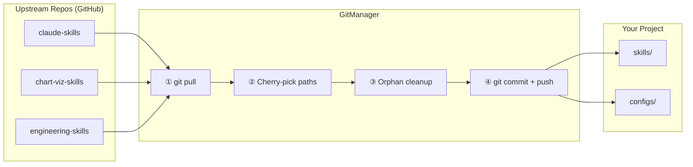

<div align="center">

# GitManager

### Compose AI Agents from Distributed Repos — Automatically

[](https://python.org)
[](https://fastapi.tiangolo.com)
[](#-testing)
[](LICENSE)

**Cherry-pick files and folders from multiple GitHub repos. Auto-sync upstream changes. Compose unified projects — zero manual effort.**

[The Problem](#-the-problem) · [How It Works](#-how-it-works) · [Use Cases](#-use-cases) · [Quick Start](#-quick-start) · [API](#-api-reference)

---



</div>

---

## 🎯 The Problem

You're building an AI agent. The best skills, tools, and reference docs are scattered across **6 different GitHub repos** from different authors. You need specific folders from each — not the whole repo.

**Without GitManager:**
```
1. git clone repo-A            ← manual
2. cp repo-A/skills/pytorch    ← manual
3. git clone repo-B            ← manual
4. cp repo-B/skills/security   ← manual
5. Repeat for 6 repos...       ← tedious
6. repo-A updates pytorch skill ← you never know
7. Your agent uses stale code   ← broken
```

**With GitManager:**
```
Configure once → Auto-pull 6 repos → Cherry-pick 35 paths → Auto-commit & push → Repeat on schedule
```

Upstream fixes a bug? **Your project inherits it automatically.** You remove a skill? **GitManager deletes it from your repo and git history.** All from a dashboard. No terminal needed.

---

## ⚙️ How It Works


```mermaid
flowchart LR
    subgraph Upstreams["Upstream Repos (GitHub)"]
        A["claude-skills"]
        B["chart-viz-skills"]
        C["engineering-skills"]
    end

    subgraph GM["GitManager"]
        Pull["① git pull"]
        Forward["② Cherry-pick paths"]
        Cleanup["③ Orphan cleanup"]
        Push["④ git commit + push"]
    end

    subgraph Target["Your Project"]
        Skills["skills/"]
        Config["configs/"]
    end

    A & B & C --> Pull --> Forward --> Cleanup --> Push --> Skills & Config
```

| Step | What Happens |
|---|---|
| **① Pull** | Clones or pulls latest from each upstream repo |
| **② Forward** | Copies only the folders/files you selected — not the whole repo |
| **③ Cleanup** | Removes orphaned paths when you delete a forwarding rule (including `git rm`) |
| **④ Push** | Auto-commits with smart messages and pushes to your repo |

All steps run on a configurable schedule (e.g., every 10 minutes) in background worker threads.

---

## 💡 Use Cases

### 🤖 AI Agent Composition *(primary use case)*

Aggregate skills from multiple AI skill repositories into a single unified agent:

```
alirezarezvani/claude-skills  →  skills/python-patterns
                                  skills/pytorch-patterns
                                  skills/security

anthropics/skills             →  skills/pdf
                                  skills/docx

your-own/custom-skills        →  skills/my-custom-tool
```

**Result:** One repo powers your AI agent with the best skills from across the ecosystem — always up to date.

### 📦 Other Use Cases

| Use Case | How |
|---|---|
| **Shared Config Sync** | Pull ESLint, Prettier, Dockerfile configs from a central standards repo into all your projects |
| **Documentation Aggregation** | Collect `/docs/` from multiple microservice repos into a single documentation site |
| **Design System Distribution** | Sync UI components from a design system repo to multiple product repos |
| **Open Source Curation** | Cherry-pick utilities from open source projects without forking entire repos |
| **Multi-Vendor Integration** | Pull deliverables from vendor repos into your main project — auto-sync on updates |

---

## ✨ Features

| Feature | Description |
|---|---|
| 🗂️ **Multi-Project** | Manage unlimited projects, each with its own upstreams, forwards, and schedule |
| 🔄 **Live Upstream Sync** | Auto-pull or clone upstream repos — always track the latest changes |
| 📁 **Selective Path Forwarding** | Cherry-pick specific folders/files — not the whole repo |
| 🧹 **Orphan Cleanup** | Remove a forward rule → files are deleted from disk AND git index |
| ⏰ **Background Scheduler** | Per-project sync interval with hot-reload — config changes apply instantly |
| 📊 **Smart Commits** | Auto-generated commit messages grouped by upstream source |


---

## ⚡ Quick Start

### 1. Clone and install

```bash
git clone https://github.com/mdnaimul22/GitManager.git
cd GitManager
pip install -r requirements.txt
```

### 2. Configure credentials

```bash
cp .env.example .env
```

```dotenv
GM_USERNAME=admin
GM_PASSWORD=your_secure_password
GM_SECRET_KEY=any_long_random_string
```

### 3. Run

```bash
python main.py
```

Open **http://localhost:8000** — that's it. 🎉

---

## 🔍 Step-by-Step Guide

### 1. Create a Project

Click **+** in the sidebar. Give it a name and the absolute path to your local Git repository.

### 2. Add Upstreams

For each source repository, define:
- **Name** — a label (e.g., `claude-skills`)
- **URL** — the GitHub clone URL
- **Branch** — which branch to track (default: `main`)
- **Path** — where to clone it locally

GitManager auto-clones on first run if the path doesn't exist.

### 3. Define Path Forwards

Select exactly which paths to copy from each upstream:

```
FROM: ~/.claude-skills/skills/python-patterns
  TO: ~/my-project/skills/python-patterns
```

Toggle individual forwards on/off without deleting them.

### 4. Run

Set the sync interval and click **Run**. The background worker handles everything automatically.

---

## 📁 Architecture

```
GitManager/
├── main.py                  # FastAPI server + graceful shutdown
├── src/
│   ├── config/              # Settings, paths, file utilities
│   ├── schema/              # Pydantic models (single source of truth)
│   ├── core/
│   │   ├── watcher.py       # Hot-reload config watcher (mtime-based)
│   │   ├── pool.py          # Background worker pool (per-project threads)
│   │   ├── rate_limiter.py  # Rate limiting + scanner auto-ban
│   │   └── resolver.py      # {REPO_ROOT} placeholder resolver
│   ├── providers/
│   │   └── git.py           # Low-level git command wrapper
│   ├── services/
│   │   ├── project.py       # Project CRUD (thread-safe)
│   │   ├── upstream.py      # Pull / clone upstream repos
│   │   ├── forward.py       # Selective copy + orphan cleanup + git rm
│   │   ├── commit.py        # Smart commit message generation
│   │   └── sync.py          # Full sync orchestrator
│   └── routers/
│       ├── auth.py          # HMAC-signed session auth
│       └── projects.py      # REST API + worker control
├── static/                  # Single-page dashboard (AlpineJS + 9 themes)
├── data/                    # Per-project JSON config (gitignored)
└── tests/                   # 67 pytest tests
```

---

## 🌐 API Reference

All endpoints require session cookie authentication.

| Method | Endpoint | Description |
|---|---|---|
| `POST` | `/api/auth/login` | Login with username & password |
| `POST` | `/api/auth/logout` | Clear session |
| `GET` | `/api/auth/check` | Validate current session |
| `GET` | `/api/projects` | List all projects |
| `POST` | `/api/projects` | Create a new project |
| `GET` | `/api/projects/{id}` | Get project with full config |
| `PUT` | `/api/projects/{id}` | Update project config |
| `DELETE` | `/api/projects/{id}` | Delete a project |
| `POST` | `/api/projects/{id}/run` | Start background sync worker |
| `POST` | `/api/projects/{id}/stop` | Stop background sync worker |

---

## 🧪 Testing

```bash
pytest tests/ -v
```

```
67 passed in 2.3s
```

Tests cover: authentication, project CRUD, worker control, rate limiting, orphan cleanup, incremental copy, hot-reload ordering, and config persistence.

---

## 🔒 Security

- **Authentication:** HMAC-SHA256 signed cookies — stateless, survives restarts
- **Rate Limiting:** 60 req/min per IP — configurable
- **Scanner Detection:** Auto-bans IPs probing for `.env`, `.git`, credentials (2 strikes → 1hr ban)
- **Localhost Whitelist:** `127.0.0.1`, `::1`, private subnets — prevents self-lockout
- **No Cloud:** Runs entirely on your machine — your data never leaves

---

## 🤝 Contributing

1. **Fork** the repository
2. **Branch:** `git checkout -b feature/your-feature`
3. **Commit:** Follow conventional commits (`feat:`, `fix:`, `chore:`)
4. **Test:** `pytest tests/` must pass
5. **PR:** Open a Pull Request

---

## 📄 License

MIT License — free to use, modify, and distribute.

---

<div align="center">

**Built to solve a real problem — keeping AI agents alive with the latest skills from across the ecosystem.**

*If this solves your problem too, give it a ⭐ on [GitHub](https://github.com/mdnaimul22/GitManager)!*

</div>
